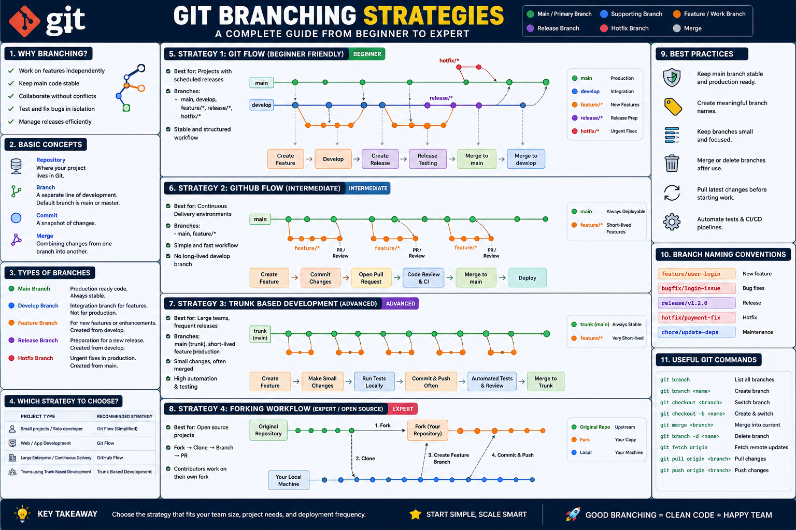

What is GIT Branch:

A Git branch is simply your own safe workspace where you can make changes without disturbing anyone else. When your work is complete and reviewed, it gets merged back into the main project.

Just imagine team of 4 workers working on building a house.

Worker A: Painting

Worker B: Electric work

Worker C: plumbing

Worker D: Interior Design

Now just imagine everyone working on same room

What happens:
    Worker A paints the wall
    Worker B drills holes for wiring
    Worker C break the wall to install pipe
    Worker D Change the wall color
here everyone overwriting each others work.

Same like happens if all developers works on main branch directly.

**So what git does here:**
     Git says Do not work on main branch

     Instead create your own copy of the room, That copy is called a Branch.

                    Main House
                    │
     ┌──────────────┼───────────────┐
     │              │               │
 Painting      Plumbing      Electrical
  Branch         Branch          Branch

with this everyone works independently and no conflicts.

FLOW:

main
   │
   ▼
Create Branch
   │
   ▼
Write Code
   │
   ▼
Commit
   │
   ▼
Push
   │
   ▼
Pull Request
   │
   ▼
Code Review
   │
   ▼
Merge
   │
   ▼
Delete Branch

**Let's Take a Real Software Example:**

We'll imagine you have joined ABC Bank as a MuleSoft/API Developer. Your team is developing an Online Banking Application.

Day 1 - The Project Starts

The application currently has only three features.

Internet Banking

✔ Login
✔ Dashboard
✔ Balance Check

The project lead says:

"This code is stable. Nobody should directly modify it."

This stable code is stored in

```python
main
```

```python
Think of main as the production branch.

               main
                 │
        Production Code
```

Day 2 - New Requirements Arrive

The Product Owner creates four stories.

| Story                   | Developer |
| ----------------------- | --------- |
| Add Money Transfer      | Raju      |
| Add Bill Payment        | Santosh   |
| Add Transaction History | Dibya     |
| Fix Login Bug           | Shetty    |

If all four developers edit main, chaos begins.

Instead

```python
Each developer creates their own branch.

                    main
                      │
      ┌───────────────┼────────────────┐
      │               │                │
feature/money     feature/bill    feature/history
                      │
               bugfix/login
```

Day 3 - Raju Starts Working

Raju creates

```python
git checkout main

git pull

git checkout -b feature/money-transfer
```


Git now creates

```python
main
   │
   └──────── feature/money-transfer

```
Both branches contain the same code initially.

```python
main

Login
Dashboard
Balance
```

```python
feature/money-transfer

Login
Dashboard
Balance
```

Exactly identical.

Raju Writes Code

He develops

```python
Money Transfer Screen

Transfer API

Validation

Confirmation Page
```

After a few hours

His branch becomes

```python
feature/money-transfer

Login
Dashboard
Balance
Money Transfer
```

But notice...

Main still remains

```python
main

Login
Dashboard
Balance
```

Production is completely safe.
================================

Santosh Starts His Work

Santosh creates

```python
feature/bill-payment
```

His branch becomes

```python
Login

Dashboard

Balance

Bill Payment
```

Again...

Main never changes.

Dibya Starts

He creates

```python
feature/transaction-history
```

Adds

```python
History

Filters

Download Statement
```

Still

Main doesn't know anything about it.

Shetty Finds a Production Bug

Customers cannot login.

This is urgent.

Instead of creating a feature branch,

He creates

```python
hotfix/login
```
```python
main
   │
   └──────── hotfix/login
```

He fixes

```python
Password validation

OTP issue

Session timeout
```

Tests

Pushes

Creates PR

Immediately merges into Main.

Now production is fixed quickly.

Visual Timeline
```python
Monday

main

Login
Dashboard
Balance
```

↓

Tuesday

```python
main
   │
   ├──────── feature/money
   ├──────── feature/bill
   ├──────── feature/history
   └──────── hotfix/login

↓

```
Wednesday

Everyone commits.

```python
feature/money

Commit 1

Commit 2

Commit 3
```
feature/bill

```python
Commit 1

Commit 2
```
feature/history

```python
Commit 1

Commit 2

Commit 3

Commit 4
```
What is a Commit?

Imagine saving a Word document.

```python
Resume.doc

Save

Save
```

Every Save is like a Commit.

Git stores every save forever.

```python
Commit 1

Added Money Screen

↓

Commit 2

Added Validation

↓

Commit 3

Fixed Bug

↓

Commit 4

Updated UI
```

So commits are simply checkpoints.

End of the Day

Raju finishes.

He pushes

```python
git push origin feature/money-transfer
```

Remote GitHub becomes

```python
GitHub

main

feature/money-transfer
```

Now he creates a Pull Request.

What is a Pull Request?

Imagine this conversation.

**Developer**

I finished my work.

**Lead**

Show me your code.

**Developer**

Here it is.

**Lead**

Reviews

# Comments

*Rename variable*

*Improve validation*

*Add logging*

Developer fixes them.

Pushes again.

Lead finally approves.

Now Git merges.

feature/money
        │
        ▼
       main
After Merge

```python
Main becomes

Login

Dashboard

Balance

Money Transfer
```

Now everyone receives it.

**What Happens to the Branch?**

Usually it's deleted.

feature/money

❌ Deleted

Because work is completed.

Another Developer Pulls Latest Code

*Santosh runs*

```python
git checkout main

git pull

```
Now his machine gets

```python
Login

Dashboard

Balance

Money Transfer
```

He creates another branch from the updated main.

A Merge Conflict Example

*Suppose Main has*

String status = "Pending";

*Raju changes it to*

String status = "Processing";

*Santosh changes it to*

String status = "Completed";

*Git sees*

*Which one is correct?*

It cannot decide.

Git reports

Merge Conflict

Developer manually edits

String status = calculateStatus();

Conflict resolved.

```python
Complete Enterprise Flow
                    GitHub

                      main
                        │
          ─────────────────────────────
                        │
                    develop
        ┌──────────────┼──────────────┐
        │              │              │
 feature/login   feature/payment  feature/history
        │              │              │
        └──────────────┼──────────────┘
                       │
                   develop
                       │
                 release/v1.0
                       │
               QA / UAT Testing
                       │
                     main
                       │
                  Production
```

How This Looks in Daily Office Life

Imagine it's 9:00 AM.

Your team lead says:

👨 Raju → Develop Money Transfer API

👩 Santosh → Build Transaction History API

👨 Dibya → Create Bill Payment API

👩 Shetty → Fix Login Issue

Each developer follows the same cycle:

```python
1. Pull latest code from main
            ↓
2. Create a new feature branch
            ↓
3. Write code
            ↓
4. Commit changes frequently
            ↓
5. Push the branch to GitHub
            ↓
6. Create a Pull Request
            ↓
7. Team reviews the code
            ↓
8. Fix review comments (if any)
            ↓
9. Merge into main/develop
            ↓
10. Delete the feature branch

```

Branching Strategies:

